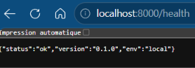
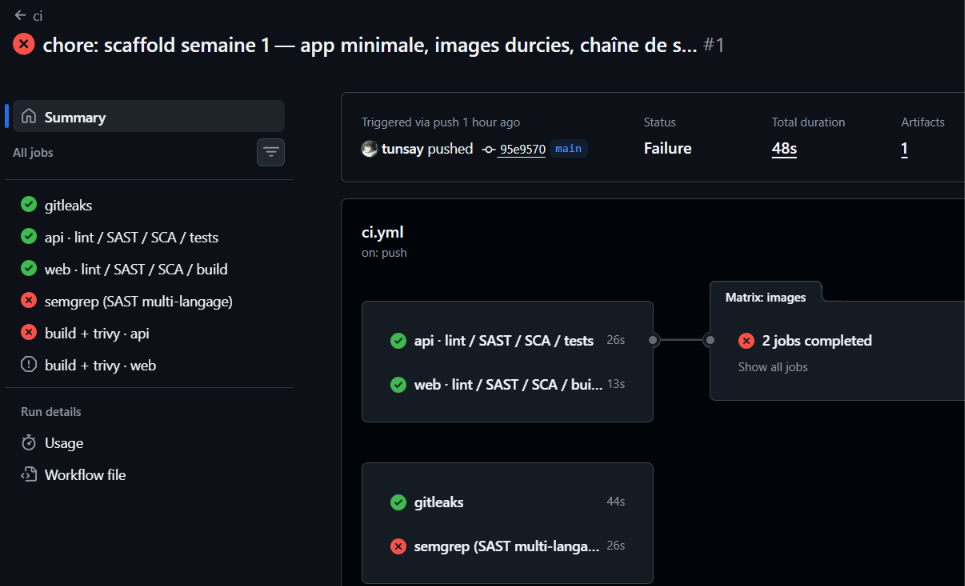
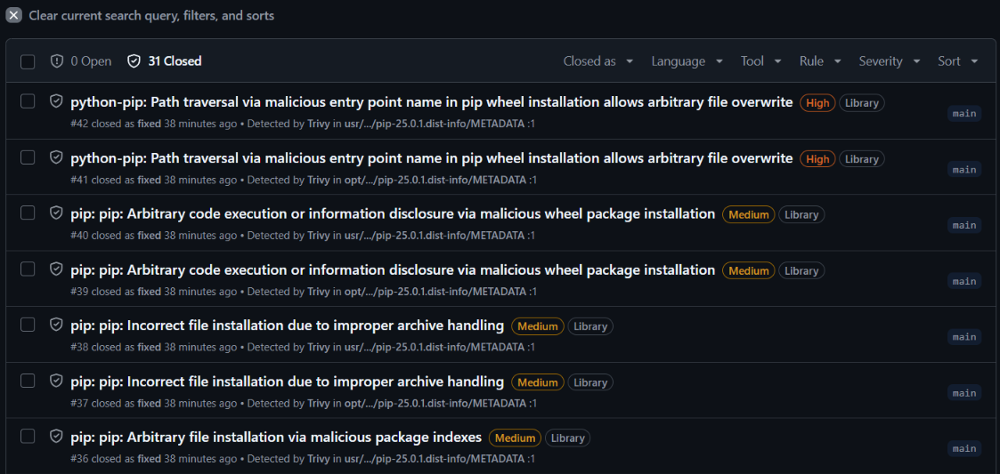
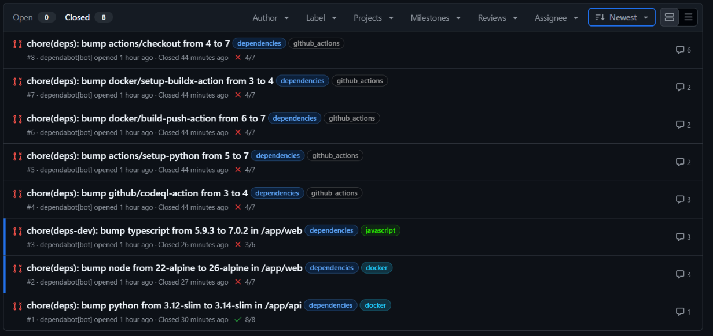
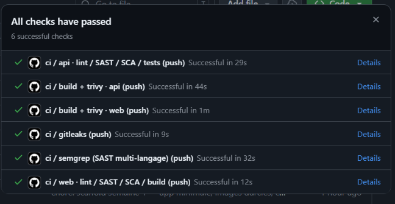

# Chapitre 1 — Jalon 1 : socle applicatif et chaîne de contrôle

*14 septembre 2026 — une journée, de zéro à une CI verte en public*

## Objectif du jalon

Une application minimale dans des conteneurs durcis, et une chaîne de contrôle qui bloque
tout ce qui ne devrait pas atteindre un dépôt ou une image : secrets, code dangereux,
dépendances vulnérables, images vulnérables. Le tout reproductible par n'importe qui en
quatre commandes.

## Ce qui a été construit



```
app/api/        FastAPI : /health, /items (CRUD en mémoire), /metrics
app/web/        React + TypeScript : une page, appelle l'API via nginx
Makefile        up / down / scan / semgrep / test / install-tools
docker-compose  read_only, cap_drop ALL, no-new-privileges, healthchecks
.github/        ci.yml (6 jobs) + dependabot.yml
.gitlab-ci.yml  équivalent GitLab, maintenu en parallèle
scripts/        install-tools.sh — outillage WSL en une commande
docs/adr/       trois décisions d'architecture
```

### Durcissement des images

| Mesure | API (Python) | Web (nginx) |
|---|---|---|
| Build multi-stage | venv construit puis copié, sans pip ni compilateur | dist Vite copié dans nginx |
| Utilisateur | UID 10001, `nologin` | UID 101 (nginx-unprivileged) |
| Correctifs OS au build | `apt-get upgrade` | `apk upgrade` |
| Gestionnaire de paquets à l'exécution | **aucun** — pip et setuptools retirés, listes apt supprimées | aucun |
| Base | `python:3.14-slim` | `nginx-unprivileged:stable-alpine3.24` |
| Healthcheck | `/health` | `/healthz` |

Côté compose : système de fichiers en lecture seule, `tmpfs` là où l'écriture est
indispensable, toutes les capacités Linux retirées, `no-new-privileges`.

### Chaîne de contrôle (`make scan` en local, même chose en CI)

| Étage | Outil | Bloque sur |
|---|---|---|
| Secrets | gitleaks (fichiers + historique) | tout secret détecté |
| SAST Python | ruff, bandit | erreur ou pattern dangereux |
| SAST TypeScript | eslint + eslint-plugin-security, tsc strict | idem |
| SAST multi-langage | semgrep (`p/owasp-top-ten`, `p/secrets`) | toute détection |
| SCA | pip-audit, npm audit | vulnérabilité connue |
| Image | Trivy | HIGH ou CRITICAL corrigeable |
| Démarrage | smoke test CI | image qui ne répond pas, ou qui tourne en root |

Avant même le commit : hooks pre-commit (gitleaks, ruff, format de message conventionnel).

## Ce qui a cassé, et ce que ça a appris

Aucun des incidents ci-dessous ne concerne le code applicatif. Tous concernent ce qui l'entoure.

### 1. Les versions épinglées au départ étaient déjà vulnérables

Avant le premier commit, en validation dans un sandbox : `pip-audit` a bloqué sur **7 CVE
dans Starlette** (dépendance de FastAPI), `npm audit` sur esbuild/Vite et ESLint.

Correction : passage aux versions courantes (FastAPI 0.141, Vite 8, ESLint 10, React 19).
Le nouveau plugin react-hooks a en plus refusé un `setState` synchrone dans un `useEffect` —
corrigé avec un flag d'annulation.

*Leçon : un scanner de dépendances ne sert pas qu'à surveiller les mises à jour futures ; il
attrape aussi les erreurs de départ.*

### 2. Trivy : 46 CVE dans les images de base, zéro dans le code

Premier `make scan` :

- `ssf-api` (python:3.12-slim) : **12 CVE, 9 HIGH, 3 CRITICAL** — perl, pcre2, sqlite, gzip.
  Toutes avec correctif Debian publié, non encore intégré à l'image officielle.
- `ssf-web` (nginx-unprivileged:1.27-alpine) : **34 CVE, 32 HIGH, 2 CRITICAL** — OpenSSL 3.3.3,
  libexpat, libpng, musl, libxml2. Image figée sur Alpine 3.21, plus reconstruite depuis des mois.

Les 23 bibliothèques Python de l'API : 0 vulnérabilité.

Corrections : `apt-get upgrade` / `apk upgrade` au build ; tag `stable-alpine3.24` qui suit une
branche maintenue plutôt qu'un tag figé ; Node 20 (fin de vie) remplacé par le LTS courant.

Résultat : **0 CVE sur les deux images.**

*Leçon : un tag de version n'est pas une image figée dans le temps, c'est une image qui
vieillit. Le bon réflexe combine un tag qui suit une branche maintenue, un upgrade des paquets
au build, et Dependabot pour être notifié.*

### 3. gitleaks : un vert qui ne voulait rien dire

Sortie du premier scan, avant `git init` :

```
INF 0 commits scanned.
INF scanned ~0 bytes (0) in 165ms
INF no leaks found
```

Zéro octet lu, verdict « aucune fuite ». Un scan qui réussit sur du vide est un faux vert.

Correction : deux appels distincts, `gitleaks dir .` (fichiers, toujours) et `gitleaks git .`
(historique, si `.git` existe). Après le premier commit : `71 900 bytes` et `3 commits scanned`.

*Leçon : lire les chiffres d'un scan, pas seulement son verdict.*

### 4. Première CI : 19 problèmes dans la CI elle-même

Premier push : 4 jobs verts, 2 rouges.



- Trivy : `trivy-action@0.28.0` n'existait pas (tag sans `v`, version ancienne).
- semgrep : **19 détections**, toutes dans les fichiers de la chaîne, aucune dans l'app :

| Règle | Occurrences | Problème |
|---|---|---|
| `github-actions-mutable-action-tag` | 13 | `actions/checkout@v7` : un tag déplaçable. Un mainteneur compromis change le code que la CI exécute sans que rien ne change dans le dépôt. |
| `dependabot-missing-cooldown` | 5 | Dependabot propose une version le jour de sa sortie. Les paquets malveillants sont généralement retirés en quelques jours. |
| `nginx request-host-used` | 1 | `proxy_set_header Host $host` relaie un en-tête contrôlé par le client. |

Corrections : toutes les actions épinglées par **SHA de commit complet** (tag en commentaire),
cooldown de 7 jours sur les cinq écosystèmes Dependabot, `Host` fixé à une valeur constante.

Un faux positif au passage : semgrep a matché `$host` dans le **commentaire** expliquant la
correction. Les règles `generic` travaillent sur le texte brut. Reformulé, pas exclu.

*Leçon : la chaîne de sécurité est elle-même du code à sécuriser, et le premier endroit où
regarder.*

### 5. Deuxième CI : un HIGH qui était MEDIUM en local

Trivy en CI a bloqué sur `ssf-api` alors que le même scan passait en local. Cause : **pip 25.0.1**
présent deux fois dans l'image (copié avec le venv, et livré dans l'image de base), avec une
CVE classée MEDIUM par Trivy 0.74 (local) et HIGH par GitHub Security (source de l'action).

Plutôt qu'arbitrer entre deux bases de sévérité : pip, setuptools et wheel retirés des deux
emplacements. L'image finale n'a plus aucun gestionnaire de paquets. Le build échoue
désormais si pip est encore présent.



*Leçon : quand deux scanners divergent sur une sévérité, la bonne réponse est souvent de
supprimer le composant plutôt que de choisir un scanner.*

### 6. Huit pull requests Dependabot, une seule acceptée

Dependabot a ouvert huit PR dans l'heure suivant le premier push. Cinq proposaient des bumps
d'actions GitHub (checkout, setup-python, codeql, buildx, build-push) : elles se sont fermées
d'elles-mêmes quand `main` a reçu l'épinglage par SHA sur les versions courantes. Restaient trois
PR à décider.



| PR | Proposition | Décision | Raison |
|---|---|---|---|
| #1 | python 3.12 → 3.14 | **Faite à la main**, avec deux corrections | La CI était verte mais n'avait jamais *démarré* l'image : pytest tournait sur le Python de la CI, pas celui du Dockerfile. Un chemin `python3.12` en dur dans le Dockerfile ne matchait plus. Ajout d'un smoke test (démarrage, réponse HTTP, vérification de l'UID) et d'un glob. |
| #2 | node 22 → 26 | **Refusée** | Node 26 n'est pas LTS avant octobre 2026. Politique écrite dans le Dockerfile : LTS uniquement. Passage manuel à Node 24. `@dependabot ignore this major version`. |
| #3 | typescript 5.9 → 7.0 | **Refusée** | Hors plage de `typescript-eslint` (`<6.1.0`). Réécriture en Go avec binaires natifs par plateforme. Nouveau releaser npm signalé par Dependabot. |

*Leçon : Dependabot propose, il ne décide pas. Une politique de mise à jour écrite vaut plus
qu'une CI verte sur la branche de la PR — surtout quand cette CI est périmée.*

### 7. L'outillage aussi : trois pièges bash

`scripts/install-tools.sh` a échoué trois fois sur la vraie machine avant de tourner :

1. `kubectl version` sort en erreur sans cluster ; avec `set -e`, le récapitulatif s'interrompait.
2. `unattended-upgrades` tenait le verrou dpkg au démarrage de WSL.
3. `(( i++ ))` renvoie 1 quand `i` vaut 0 — sous `set -e`, la boucle d'attente mourait au premier tour.

Chaque correction est dans le script, versionnée. Le script fait partie de la preuve de
reproductibilité.

## Preuves — tests d'intrusion locaux

Effectués sur l'environnement `make up`, depuis WSL.

### En-têtes servis par nginx

```
Server: nginx
Content-Security-Policy: default-src 'self'; script-src 'self'; style-src 'self'; img-src 'self' data:;
  connect-src 'self'; frame-ancestors 'none'; base-uri 'self'; form-action 'self'
X-Content-Type-Options: nosniff
X-Frame-Options: DENY
Referrer-Policy: no-referrer
```

Version de nginx masquée. CSP sans `unsafe-inline`, sans origine externe.

### Validation d'entrée

| Requête | Réponse |
|---|---|
| `{"name":"","quantity":-1}` | 422, `string_too_short`, `greater_than_equal` |
| nom de 5 000 caractères | 422, `string_too_long` (max 80) |
| `PUT /api/items` | 405 |
| `Host: evil.example` | traité normalement — nginx a substitué l'en-tête |

Aucun 500 : la validation Pydantic s'exécute avant le code applicatif.

### Exécution de code dans le conteneur API

Simulation d'un attaquant ayant obtenu un shell dans l'API :

```
$ id
uid=10001(app) gid=10001(app) groups=10001(app)
$ touch /srv/x
touch: cannot touch '/srv/x': Read-only file system
$ pip install requests
sh: 3: pip: not found
$ apt-get install curl
E: Could not open lock file /var/lib/dpkg/lock-frontend - open (13: Permission denied)
$ cat /proc/1/status | grep Cap
CapInh: 0000000000000000
CapPrm: 0000000000000000
CapEff: 0000000000000000
CapBnd: 0000000000000000
CapAmb: 0000000000000000
$ ls /var/run/docker.sock
ls: cannot access '/var/run/docker.sock': No such file or directory
```

Pas root, pas d'écriture, pas d'installation, aucune capacité (borne comprise), pas d'accès
au démon Docker.

## État en fin de jalon



- Dépôt public : github.com/tunsay/secure-software-factory
- CI : 6 jobs, verts, actions épinglées par SHA, smoke test des images
- Images : 0 CVE HIGH/CRITICAL, non-root, sans gestionnaire de paquets
- Security : 31 alertes ouvertes puis closes dans la journée, 0 restante
- 5 commits sur `main`, 8 PR Dependabot traitées — 2 refusées avec politique écrite, 1 bump fait à la main

## Ce qui reste ouvert, et pourquoi

| Point | Statut | Traitement prévu |
|---|---|---|
| Aucune authentification, aucune limitation de débit | assumé (ADR 0001) | hors périmètre |
| `/api/docs` et `/api/metrics` accessibles | voulu en local | restreindre par environnement, S6 |
| Les erreurs 422 renvoient l'entrée complète | défaut FastAPI | handler d'erreur en prod, S6 |
| L'API peut joindre le front sur le réseau compose | réseau plat | NetworkPolicies, S3 |
| Actions épinglées, mais images de base par tag | — | épinglage par digest, S4 |
| Pas de SBOM, pas de signature | — | S4 |
