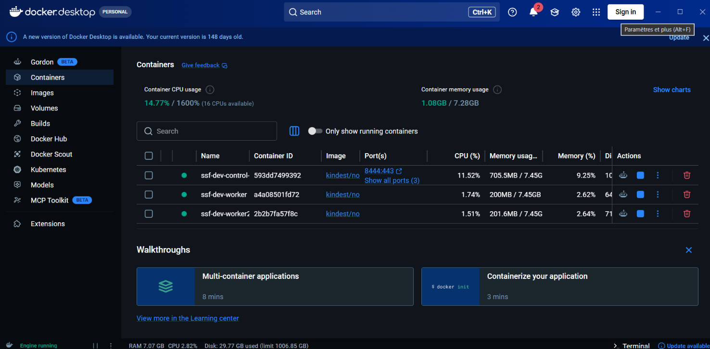

# Chapitre 2 — Jalon 2 : Terraform pilote le cluster

*18 septembre 2026 — un changement de plan, six incidents sous le code, un cluster décrit de bout en bout*

## Changement de plan

Le jalon prévoyait Terraform sur AWS free tier. L'ouverture d'un compte AWS exige des
coordonnées personnelles vérifiées ; elles ne sont pas communiquées pour ce projet. La décision
et ses conséquences sont dans l'[ADR 0004](../adr/0004-terraform-sans-fournisseur-cloud.md) :
Terraform provisionne et configure le **cluster local**, le registre d'images devient **GitHub
Container Registry**, et l'argument « zéro secret statique » est conservé — la CI s'authentifie
avec le token OIDC de GitHub.

Ce qui est perdu : la preuve de provisioning cloud. C'est dit tel quel, pas contourné.

## Ce qui a été construit

```
infra/terraform/
  cluster/            kind : 1 control-plane + 2 workers, image épinglée par digest — état local
  platform/           namespaces durcis — état distant (backend kubernetes, verrou par lease)
  modules/namespace/  PSS restricted en enforce, ResourceQuota, LimitRange
```

| Couche | Rôle | État |
|---|---|---|
| `cluster` | Crée le cluster. C'est le bootstrap : il ne peut pas stocker son état dans ce qu'il crée. | local, ignoré par git |
| `platform` | Configure le cluster. Namespaces `ssf` (application) et `security` (contrôleurs). | Secret dans le cluster, verrou natif |

Le module `namespace` refuse structurellement le niveau `privileged` (validation de variable),
pose les trois labels Pod Security Standards en `restricted`, et injecte des limites par défaut
dans tout conteneur qui n'en déclare pas.

Côté CI : un job `iac` (`terraform fmt`, `validate`, Checkov avec upload SARIF, `trivy config`)
et, sur `main` uniquement, après tous les contrôles, le push des deux images vers
`ghcr.io/tunsay/ssf-{api,web}:<sha>` — jamais `latest`.



## Ce qui a cassé, et ce que ça a appris

Aucun des six incidents n'était dans le code Terraform. `fmt`, `validate`, Checkov et Trivy
étaient verts avant le premier `apply`. Tout s'est joué en dessous.

### 1. cgroup v1 : l'hôte refusé par Kubernetes

Premier `apply` : `kubeadm init` échoue, `exit status 1`, sans autre message. En reproduisant
avec kind en ligne de commande et `--retain`, puis en lisant le journal du kubelet :

```
kubelet is configured to not run on a host using cgroup v1.
cgroup v1 support is unsupported and will be removed in a future release
```

WSL2 démarre en cgroup v1 par défaut. Kubernetes ≥ 1.31 refuse. Correction côté hôte :
`kernelCommandLine = cgroup_no_v1=all systemd.unified_cgroup_hierarchy=1` dans `.wslconfig`,
puis `wsl --shutdown`. Vérification : `stat -fc %T /sys/fs/cgroup` → `cgroup2fs`.

*Leçon : l'erreur remontée par Terraform (« exit status 1 ») est à quatre couches de la cause
(Terraform → provider → kubeadm → kubelet → noyau). Il faut descendre.*

### 2. Deux bugs qui se masquaient

Pendant le diagnostic du premier incident, le patch kubeadm (`kubeletExtraArgs`) avait été
réécrit au format liste (API `v1beta4`, Kubernetes ≥ 1.31). Une fois cgroup v2 en place, kind en
ligne de commande réussissait — et le provider Terraform échouait toujours.

Cause : le provider `tehcyx/kind` 0.11.0 embarque **sa propre** bibliothèque kind (0.31.0,
décembre 2025), qui génère encore une config kubeadm `v1beta3` — où `kubeletExtraArgs` est une
map. Le kind installé sur le poste (0.33.0) génère du `v1beta4`. Le même patch ne peut pas
convenir aux deux. Diagnostic décisif : télécharger le binaire kind 0.31.0 et lire sa sortie :

```
error unmarshaling configuration ... kubeadm.k8s.io/v1beta3 ... InitConfiguration:
json: cannot unmarshal array into Go struct field NodeRegistrationOptions.nodeRegistration.kubeletExtraArgs of type map[string]string
```

Retour au format map. Le premier échec (map) était cgroup v1 ; le format n'y était pour rien.

*Leçon : quand on corrige deux choses à la fois, on ne sait plus laquelle a agi. Et une
bibliothèque embarquée dans un provider ne suit pas la version de l'outil installé.*

### 3. Image de nœud trop récente pour le provider

Même cause, autre symptôme : l'image `kindest/node:v1.37.0` (kind 0.33) n'est pas connue de la
bibliothèque kind 0.31 du provider. Passage à `v1.35.0`, digest pris dans les notes de release
de kind **0.31.0**, pas de la dernière version. La variable `node_image` documente cette
contrainte et refuse tout tag sans digest.

### 4. Cluster détruit par un redémarrage de Docker Desktop

Après la preuve PSS, Docker Desktop a été relancé (depuis l'assistant, pour une capture d'écran).
Résultat : `docker ps -a` vide, `docker events` vide, cache d'images vidé. Le daemon avait
redémarré et perdu ses conteneurs. Terraform, lui, croyait encore au cluster.

Et là, un défaut réel du provider : au `plan`, au lieu de constater l'absence et de proposer
`1 to add` comme le ferait un provider mature, il **plante** :

```
Error: could not locate any control plane nodes for cluster named 'ssf-dev'
```

Récupération : `terraform state rm kind_cluster.this`, puis `apply`. L'état de la couche
platform, stocké dans le cluster, est parti avec lui — cohérent, et documenté dans l'ADR 0004 :
la durée de vie de cet état est celle du cluster.

*Leçon : un cluster kind est jetable, et il faut le traiter comme tel. Ne rien lancer sur
l'hôte pendant qu'il tourne, et savoir le reconstruire en une commande — ce qui est le cas.*

### 5. Ports 80 et 443 refusés par Windows

À la reconstruction, `docker run` refuse avec `ports are not available ... /forwards/expose
returned unexpected status: 500`. Le relais réseau de Docker Desktop ne peut pas publier 80 et
443 sur Windows (service HTTP système ou plage exclue Hyper-V). Bascule sur 8081/8444 — distincts
aussi de 8080/8000 utilisés par docker compose, pour que les deux environnements coexistent.

### 6. Le chemin du SARIF Checkov

Première CI : Checkov vert, mais l'upload vers l'onglet Security échoue, `Path does not exist:
checkov-out/results_sarif.sarif`. Avec une seule sortie fichier, `--output-file-path
console,X` écrit le SARIF **dans** `X`, pas dans un dossier `X/`. Corrigé en nommant le fichier
explicitement.

## Preuve — un pod root refusé à l'admission

```
$ kubectl -n ssf run pss-probe --image=busybox:1.37 --restart=Never --command -- sleep 5
Error from server (Forbidden): pods "pss-probe" is forbidden: violates PodSecurity "restricted:latest":
  allowPrivilegeEscalation != false (container "pss-probe" must set securityContext.allowPrivilegeEscalation=false),
  unrestricted capabilities (container "pss-probe" must set securityContext.capabilities.drop=["ALL"]),
  runAsNonRoot != true (pod or container "pss-probe" must set securityContext.runAsNonRoot=true),
  seccompProfile (pod or container "pss-probe" must set securityContext.seccompProfile.type to "RuntimeDefault" or "Localhost")
```

L'API server refuse le pod avant qu'il n'existe : aucun conteneur créé, aucun kubelet sollicité.
Quatre violations, chacune avec la correction attendue. Ce contrôle est natif à Kubernetes ;
Terraform l'a activé avec trois labels.

```
$ kubectl -n ssf describe quota quota
Resource         Used  Hard
limits.cpu       0     2
limits.memory    0     2Gi
pods             0     20
requests.cpu     0     1
requests.memory  0     1Gi
```


## Démonstration : à quoi sert vraiment Terraform ici

Une preuve d'admission montre qu'un pod est refusé. Elle ne montre pas ce qu'on évite. Pour ça,
on lance **la même attaque dans deux namespaces** : `default`, que Terraform n'a pas touché, et
`ssf`, sur lequel Terraform a posé les Pod Security Standards `restricted`. Un seul manifeste
(`security/attacks/hostpath-escape.yaml`), rejoué par `make attack-escape`.

L'attaque est l'une des plus courantes sur Kubernetes : un pod privilégié qui monte le système
de fichiers du nœud (`hostPath: /`). Un attaquant n'a besoin que du droit de créer un pod —
souvent obtenu via un compte de service trop permissif.

### Sans le durcissement Terraform — namespace `default`

Le pod démarre. Depuis le conteneur, l'attaquant lit le fichier des mots de passe **du nœud** :

```
$ kubectl -n default exec node-pwn -- head -3 /host/etc/shadow
root:*:20430:0:99999:7:::
daemon:*:20430:0:99999:7:::
bin:*:20430:0:99999:7:::
```

Et voit les processus de l'hôte, dont le kubelet qui pilote le nœud :

```
$ kubectl -n default exec node-pwn -- ps -o pid,args | grep kubelet
221 /usr/bin/kubelet --kubeconfig=/etc/kubernetes/kubelet.conf ... --provider-id=kind://docker/ssf-dev/ssf-dev-worker
```

À ce stade, le conteneur n'est plus un conteneur : c'est un accès root à la machine. Il peut lire
les secrets des autres pods, modifier le kubelet, rebondir sur tout le cluster. **Un droit de
créer un pod est devenu la prise de contrôle du nœud.**

### Avec le durcissement Terraform — namespace `ssf`

Le même manifeste, soumis à `ssf`, est refusé par l'API server **avant toute création** :

```
Error from server (Forbidden): pods "node-pwn" is forbidden: violates PodSecurity "restricted:latest":
  host namespaces (hostPID=true),
  privileged (container "pwn" must not set securityContext.privileged=true),
  allowPrivilegeEscalation != false,
  unrestricted capabilities (must set capabilities.drop=["ALL"]),
  restricted volume types (volume "host-root" uses restricted volume type "hostPath"),
  runAsNonRoot != true,
  runAsUser=0 (must not set runAsUser=0),
  seccompProfile (must set seccompProfile.type to "RuntimeDefault" or "Localhost")
```

Huit règles violées, huit refus. Aucun conteneur créé, aucun nœud exposé.

### Ce que ça prouve

| | `default` (non durci) | `ssf` (durci par Terraform) |
|---|---|---|
| Le pod privilégié | démarre | refusé à l'admission |
| `/etc/shadow` du nœud | lu | inatteignable |
| Processus de l'hôte | visibles | inatteignables |
| Résultat | nœud compromis | attaque bloquée |

**La seule différence entre ces deux namespaces, ce sont trois labels que Terraform a posés sur
l'un et pas sur l'autre.** Pas l'application, pas le réseau : trois lignes d'infrastructure as
code, dans le module `namespace`. C'est la réponse concrète à « pourquoi Terraform, pour un
projet aussi petit ». Le durcissement n'est pas un fichier qu'on applique une fois et qu'on
oublie ; c'est du code, versionné, rejouable, et vérifiable par une attaque.

## État en fin de jalon

- Terraform crée et configure le cluster ; `make infra-up` / `make infra-down`, plan affiché, confirmation demandée
- État platform distant et verrouillé ; état cluster local, ignoré par git
- CI : 7 jobs verts, dont `iac` (fmt, validate, Checkov → Security, trivy config)
- Images publiées sur GHCR à chaque push sur `main`, taguées par SHA, sans secret
- Preuve d'admission : pod root refusé, quota en place
- Démonstration avant/après : évasion `hostPath` réussie dans `default`, bloquée dans `ssf` — `make attack-escape`

## Ce qui reste ouvert, et pourquoi

| Point | Statut | Traitement prévu |
|---|---|---|
| Réseau plat entre namespaces | ouvert | NetworkPolicies deny-by-default, S3 |
| Aucun workload déployé dans le cluster | ouvert | chart Helm de l'app, S3 |
| Paquets GHCR privés par défaut | à faire à la main | rendre publics avant que kind ne tire les images, S3 |
| Provider kind : plante sur un cluster disparu, bibliothèque en retard | limite de l'outil | suivi via Dependabot (écosystème terraform ajouté) |
| Ports d'ingress 8081/8444 au lieu de 80/443 | assumé | — |
| Pas de provisioning cloud | assumé (ADR 0004) | — |
