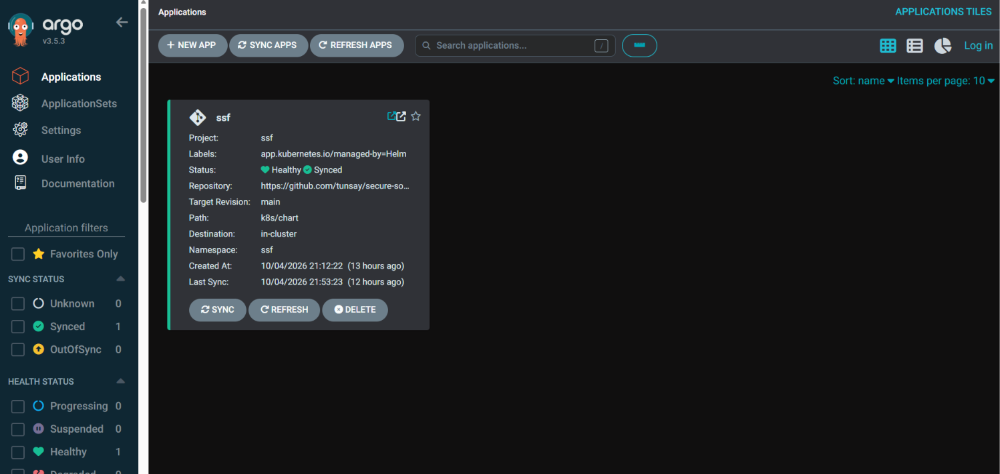

# Chapitre 5 — Jalon 5 : policy as code et GitOps

*4 octobre 2026 — le cluster refuse ce qui ne vient pas de la chaîne, revient seul à l'état du
dépôt, et l'outil de déploiement n'a plus les clés du cluster*

## Objectif du jalon

À la fin du jalon 4, les images sont signées, décrites par un SBOM et déployées par digest. Mais
**personne ne vérifie la signature au moment où ça compte** : l'entrée dans le cluster. Et le
déploiement reste un acte manuel — `terraform apply` — qui ne voit pas ce qui change ensuite dans
le cluster.

Deux livrables :

- **5a — admission** : Kyverno refuse à l'entrée du cluster une image non signée par la CI, d'un
  autre registre, ou désignée par un tag ;
- **5b — GitOps** : ArgoCD déploie l'application depuis le dépôt et annule toute modification
  manuelle — sans recevoir, au passage, les droits d'administrateur du cluster.

Même méthode qu'aux jalons précédents : une commande lancée **avant** et **après**
(`make admission-proof`, `make drift-proof`), et la même preuve rejouée en CI sur un cluster neuf.

## Ce qui a été vérifié avant d'écrire

- **Versions** : Kyverno 1.19.1 (chart 3.9.1), Argo CD 3.5.3 (chart 10.9.2, la plus récente de plus
  de 7 jours). Délai de carence appliqué comme aux jalons précédents.
- **Kyverno 1.19 déprécie `ClusterPolicy`** (retrait en 1.20, ~novembre 2026) : les politiques sont
  écrites directement dans les nouveaux types CEL, `ImageValidatingPolicy` et `ValidatingPolicy`,
  champ par champ d'après la CRD de la version installée.
- **Le chart d'Argo CD fait de son contrôleur un administrateur du cluster** : ClusterRole `*` sur
  `*`, lue dans le template. Raison de toute la conception du 5b.
- **ArgoCD juge un Ingress sain seulement s'il a une adresse publiée** (lu dans son source) ;
  Traefik en NodePort n'en publiait pas : l'application serait restée « Progressing » à vie.
  Traefik publie désormais `127.0.0.1`, son adresse réelle.
- **Une prémisse fausse, rattrapée par la mesure** : Kyverno était réputé incapable de lire les
  signatures cosign v3 sur GHCR. Mesuré : faux pour le type de politique utilisé (incident 1).

## 5a — Seul ce que la CI a signé entre dans le cluster ([ADR 0012](../adr/0012-kyverno-et-double-signature.md), [0013](../adr/0013-signature-v3-seule.md))

Deux politiques sur le namespace `ssf`, installées par Terraform après Kyverno :

| Politique | Exige | Message de refus |
|---|---|---|
| `ssf-signature-ci` (`ImageValidatingPolicy`) | pour toute image `ghcr.io/tunsay/ssf-*` : une signature **et** un SBOM CycloneDX signés par l'identité exacte du workflow `ci` de ce dépôt, sur `main` | « image non signée par le workflow ci de ce dépôt sur main » |
| `ssf-registre-et-digest` (`ValidatingPolicy`) | toute image, conteneurs d'initialisation compris : registre `ghcr.io/tunsay/` seul, et désignée par digest | « registre non autorisé » / « image sans digest » |

Choix notables :

- **`failurePolicy: Fail`** : si Kyverno ne peut pas vérifier, le pod est refusé. « Je n'ai pas pu
  contrôler » vaut « refusé ».
- **Deux politiques complémentaires** : la vérification de signature ne regarde que nos images ;
  sans la règle de registre, une image d'un autre registre échapperait à tout contrôle.
- **`Warn` avant `Deny`** : le cluster a d'abord admis en signalant ce qu'il aurait refusé. Nos
  propres images passaient sans avertissement ; alors seulement, le blocage a été activé.
- **`mutateDigest: false`** : Kyverno ne réécrit pas les manifestes, sinon ArgoCD verrait une
  dérive permanente.

### Avant / après — `make admission-proof`

Chaque test soumet au cluster un pod conforme à PSS restricted (dry-run serveur, rien n'est
créé) : seule l'image change.

| Image soumise | Avant | Après |
|---|---|---|
| Signée par la CI, par digest (celle qui tourne) | admise | **admise** |
| Jamais signée, par tag | admise | **refusée** — sans digest |
| Jamais signée, par digest | admise | **refusée** — non signée par la CI |
| `busybox` de Docker Hub, par digest | admise | **refusée** — registre non autorisé |
| `ssf-api:latest` (n'existe même pas dans le registre) | admise | **refusée** — sans digest |
| Signée par la CI au seul format cosign v3 | — | **admise** |

**La preuve maîtresse du plan est faite** : une image non signée, parfaitement conforme à PSS, est
refusée par le cluster lui-même. Et la preuve ne repose pas que sur le dry-run : les pods de
l'application, recréés sous la politique bloquante, sont admis ; sur un cluster neuf en CI, avec
Kyverno en `Deny` dès le départ, l'application est admise aussi.

## 5b — Le dépôt fait foi ([ADR 0014](../adr/0014-gitops-argocd-sans-droits-cluster.md))

ArgoCD déploie le chart `k8s/chart` de **ce dépôt**, avec `values-dev.yaml`. Déployer une version
= un commit sur ce fichier. Synchronisation automatique, suppression de ce qui disparaît du dépôt
(`prune`), annulation des modifications manuelles (`selfHeal`). Terraform ne déploie plus
l'application ; il garde la plateforme, **et les droits d'ArgoCD**.



### Un outil de déploiement sans les clés du cluster

| | Chart par défaut | Ici |
|---|---|---|
| Droits du contrôleur | ClusterRole `*` sur `*` : tout le cluster | un Role dans `ssf` : Deployments, Services, ServiceAccounts, Ingress ; lecture des ReplicaSets et des pods |
| Identifiants du cluster | — | aucun jeton stocké : le compte de service du pod |
| Ce que le projet ArgoCD admet | tout dépôt, toute destination | ce dépôt, le namespace `ssf`, aucun objet de niveau cluster |
| Comptes | `admin`, mot de passe généré | aucun : interface anonyme en lecture seule, non exposée |

Mesuré à la fin de `make drift-proof`, en demandant au cluster ce que le compte du contrôleur peut
faire (`kubectl auth can-i`) :

```
   modifier les Deployments de ssf                      : yes
   lire les Secrets de ssf                              : no
   supprimer les NetworkPolicies de ssf                 : no
   se donner des droits dans ssf (RoleBinding)          : no
   créer un Deployment dans kube-system                : no
   se donner des droits sur le cluster                  : no
```

Un ArgoCD compromis, ou un commit malveillant dans `k8s/`, ne peut ni lire un secret, ni ouvrir
un flux réseau, ni sortir de `ssf`. Et ce qu'il déploie passe encore par Kyverno.

### Avant / après — `make drift-proof`

Cinq modifications faites à la main, comme le ferait un opérateur pressé ou un attaquant avec un
accès kubectl ; puis 60 secondes d'observation.

| Modification manuelle | Avant (Terraform) | Après (ArgoCD, cluster neuf en CI) |
|---|---|---|
| 1. `APP_ENV` de l'API passé de `dev` à `prod` | persistante | **annulée en ~21 s** |
| 2. front à 0 réplique (application en panne) | persistante | **annulée en ~9 s** |
| 3. Service de l'API supprimé (API injoignable) | persistante | **annulée en ~27 s** |
| 4. variable ajoutée, que le dépôt ne décrit pas | persistante | persistante |
| 5. objet étranger créé dans `ssf` | persistante | persistante |
| L'outil de déploiement voit-il la dérive ? | **non** — `terraform plan` : « no differences » | **oui**, et la répare |

Avant, l'application était en panne et configurée autrement que le dépôt, pendant que le seul
outil de déploiement affirmait que tout était conforme. Après, ce que le dépôt décrit revient
seul en moins de 30 secondes.

Les lignes 4 et 5 sont une **limite réelle, mesurée** : ArgoCD compare avec ce qu'il a lui-même
appliqué. Un champ qu'il n'a jamais posé n'est pas, pour lui, une dérive ; un objet qu'il n'a pas
créé ne le concerne pas — ses droits ne lui permettent même pas de lire les ConfigMaps de `ssf`.
Ce cas relève des autres verrous : qui peut écrire dans `ssf`, et ce qui peut y tourner.

Cette preuve tourne à chaque changement d'infrastructure dans le workflow e2e (`make
drift-check`), qui échoue si une dérive décrite persiste ou si les droits d'ArgoCD s'élargissent.
Sur le poste, la même preuve a mis environ 90 secondes à converger : incident 3 ci-dessous.

## Avant / après — de quoi on est protégé

| Question | Avant | Après |
|---|---|---|
| Une image non signée par la CI peut-elle tourner dans `ssf` ? | **oui**, même conforme à PSS | **non**, refusée à l'admission |
| Une image d'un autre registre, ou par tag ? | oui | **non** |
| Si le contrôleur d'admission est indisponible ? | sans objet | **refus** (`failurePolicy: Fail`) |
| Une modification manuelle de l'application persiste-t-elle ? | **oui**, et Terraform ne la voit pas | **non**, annulée par ArgoCD (ce que le dépôt décrit) |
| Que donne la compromission de l'outil de déploiement ? | sans objet (déploiement manuel) | l'écriture de 4 types d'objets dans `ssf`, rien d'autre |
| Un mot de passe d'administration existe-t-il pour le déploiement ? | sans objet | **non**, aucun compte |

## Ce qui a cassé, et ce que ça a appris

**1. La prémisse d'une décision était fausse — la mesure l'a démentie.** La double signature
(ADR 0012) reposait sur une PR Kyverno décrivant un défaut GHCR. Un sixième test, écrit pour
vérifier cette prémisse, l'a contredite : une image signée au seul format v3 est admise. La PR ne
touchait que le code de `ClusterPolicy`, pas celui des politiques CEL utilisées ici. Double
signature retirée (ADR 0013).
*Leçon : lire une PR, c'est lire ce qu'elle modifie, pas seulement ce qu'elle décrit.*

**2. « Application en panne » : c'était la vérification qui se trompait.** Pour faire recréer les
pods sous la politique bloquante, ils ont été supprimés ; `kubectl rollout status` a répondu
« terminé » aussitôt, et la preuve suivante a trouvé zéro pod. Le Deployment n'ayant pas changé,
`rollout status` n'attendait rien. Kyverno avait bien admis les nouveaux pods.
*Leçon : attendre l'état qu'on veut constater (`kubectl wait --for=condition=Ready`), pas un état
voisin.*

**3. Sur le poste, ArgoCD répare en 90 secondes au lieu de quelques-unes : Kyverno vérifie aussi
les Deployments.** Après la bascule, la preuve de dérive locale affiche cinq dérives
persistantes, puis une simple mise à jour du Deployment échoue sur un délai dépassé. Le journal de
Kyverno montre que la politique de signature, écrite pour les pods, s'applique aussi aux
Deployments : chaque modification déclenche une vérification de signature (GHCR, Rekor) dans la
requête d'admission. Sur le poste, elle a dépassé le temps accordé, et `failurePolicy: Fail` a
changé la lenteur en refus. ArgoCD a réessayé seul : application rétablie après environ 90 s. Les
nœuds n'étaient pas saturés ; en CI, la même preuve passe sous 60 s.
*Leçon : une politique d'admission est sur le chemin critique de tout ce qui la traverse, y
compris de l'outil qui répare.*

## Écarts au plan

| Prévu | Fait | Pourquoi (décisions de Tunsay) |
|---|---|---|
| ArgoCD sur un dépôt de manifests séparé | ce dépôt, `k8s/` | le workflow e2e déploie exactement le commit testé ; aucun jeton d'écriture vers un autre dépôt, la CI ne peut pas déployer |
| Kyverno exige runAsNonRoot et des limites | laissé à PSS restricted et au LimitRange | déjà imposés depuis le jalon 2 ; le LimitRange injecte les limites avant que Kyverno voie le pod, une règle « limites » ne pourrait jamais échouer |
| Bonus Sealed Secrets, kube-bench (reportés du jalon 3) | abandonnés | aucun secret applicatif à protéger ; kube-bench s'exécute en pod privilégié, à l'opposé de la posture du cluster |

## État en fin de jalon

- **Kyverno 1.19.1 en `Deny`** sur `ssf` : signature, SBOM, registre, digest. Politiques CEL,
  rien de déprécié.
- **CI : signature au seul format cosign v3**, vérifiée par Kyverno sur GHCR (ADR 0013).
- **Argo CD 3.5.3** déploie l'application depuis le dépôt, sans droits de cluster, sans compte.
- **Terraform** garde la plateforme : namespaces, Traefik, NetworkPolicies, Kyverno, ArgoCD et ses
  droits.
- **Workflow e2e** : cluster neuf, Kyverno en `Deny` dès le départ, application déployée par
  ArgoCD au commit testé, isolation, application, et `make drift-check` à chaque changement.
- Trois ADR (0012, 0013, 0014), trois incidents documentés.

## Ce qui reste ouvert, et pourquoi

| Point | Statut | Traitement prévu |
|---|---|---|
| La règle « SBOM signé obligatoire » n'a jamais été vue refuser une image signée **sans** SBOM : aucune image de ce type n'existe | limite de preuve | publier une image de test signée sans SBOM, dans un dépôt de test |
| ArgoCD n'annule que ce que le dépôt décrit | limite de l'outil | droits Kubernetes et Kyverno couvrent les objets étrangers |
| Kyverno vérifie aussi les Deployments : sa latence est dans le chemin du déploiement et de l'auto-réparation (incident 3) ; cause de la lenteur locale non mesurée | choix à faire | garder (refus dès l'application d'un Deployment non signé) ou restreindre aux pods (vérifiés à leur création) |
| Les composants de plateforme (Traefik, Kyverno, ArgoCD) ne sont pas soumis à la règle de signature, qui protège `ssf` | assumé | leurs images sont épinglées par version dans Terraform |
| Build de l'API non reproductible (celui du front l'est : même digest entre deux commits) | constaté | à étudier (horodatages, bytecode Python) |
| 9 PR Dependabot ouvertes | à trier | à la main, selon la politique du dépôt |
| Images d'outils tirées par tag mobile en CI, poste en Python 3.10 / Node 22 | ouvert (jalon 4) | inchangé |
