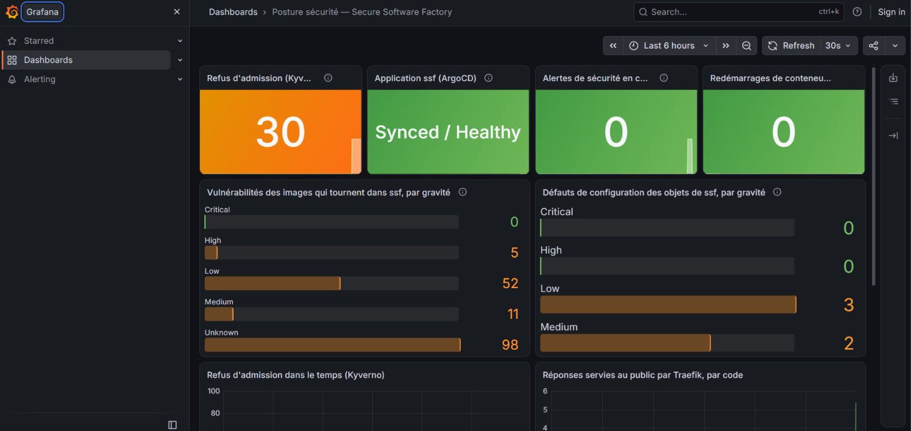
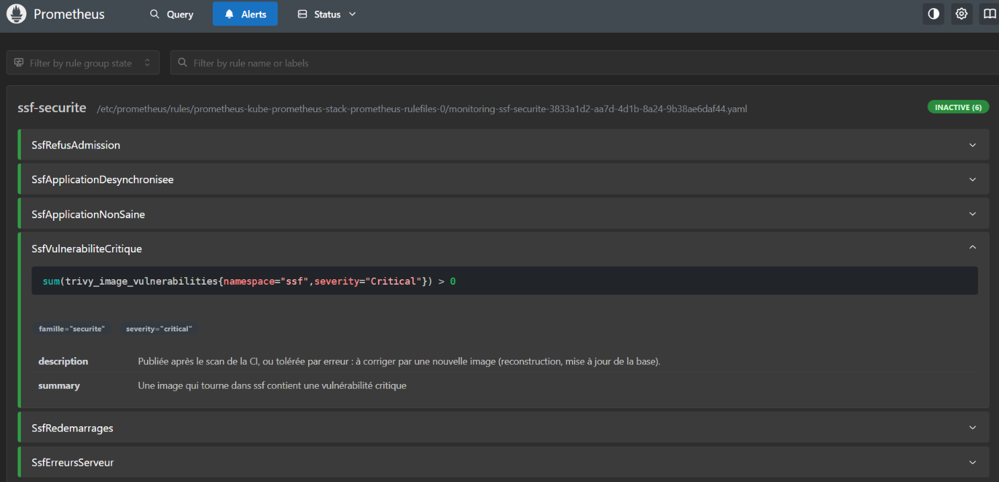

# Chapitre 6 — Jalon 6 : DAST, observabilité et mise en récit

*4 et 5 octobre 2026 — regarder l'application comme un attaquant, voir ce que la chaîne refuse
et répare, et expliquer pourquoi chaque contrôle existe*

## Objectif du jalon

À la fin du jalon 5, la chaîne **empêche** : code dangereux, dépendance vulnérable, image non
signée, pod root, flux réseau non prévu, modification manuelle. Trois angles morts restent :

- **personne ne regarde l'application qui tourne** : tous les scans portent sur le code, les
  dépendances, les images — jamais sur ce qu'un visiteur reçoit vraiment ;
- **rien ne raconte** : un refus d'admission, une dérive annulée, une faille publiée après le
  déploiement ne laissent aucune trace consultable ;
- **rien ne justifie** : une liste de contrôles n'est pas une démarche.

Trois livrables, plus la vitrine :

- **6a — DAST** : OWASP ZAP analyse l'application servie par Traefik, et quatre tests ciblés
  visent les dettes notées au jalon 1 ;
- **6b — observabilité** : Prometheus, Grafana, trivy-operator, et des alertes de sécurité ;
- **6c — modèle de menaces** : STRIDE, cadré par les ateliers d'EBIOS RM, chaque menace reliée
  à son contrôle et à sa preuve ([`docs/threat-model.md`](../threat-model.md)) ;
- **6d — vitrine** : README final, page GitHub Pages, rapport en PDF.

## 6a — L'application vue de l'extérieur

`make dast` : ZAP 2.17.0 (scan *baseline*, passif : rien n'est attaqué), lancé dans le réseau
Docker de kind contre le NodePort de Traefik, puis quatre questions que ZAP ne peut pas trouver
seul, faute de page qui y mène.

### Avant / après

| | Avant | Après |
|---|---|---|
| Avertissements ZAP | **5** | **0** |
| Contrôles ZAP réussis | 62 | **65** |
| `/api/metrics`, `/api/openapi.json`, `/api/docs` | **publics** (200) | **fermés** (404) |
| Erreur de validation (422) | **renvoie l'entrée**, ici un `<script>` | indique le champ et la raison, jamais la valeur |
| Adresse inconnue | 200, la page d'accueil | 404 |

Ce que le DAST a trouvé, et qu'aucun outil statique n'avait vu :

- **Les en-têtes de sécurité disparaissaient sur les fichiers JS et CSS.** Le bloc nginx des
  fichiers statiques déclarait son propre `add_header Cache-Control` ; or nginx n'hérite des
  `add_header` du niveau supérieur **que si le bloc n'en déclare aucun**. Un seul en-tête ajouté
  supprimait la CSP, `nosniff`, `X-Frame-Options`… pour ce bloc. Hypothèse formulée avant le
  scan, confirmée par lui. Correction : les en-têtes dans un fichier inclus dans chaque bloc.
- **L'isolation entre origines n'avait jamais été configurée** (défense contre les attaques de
  type Spectre) : trois en-têtes ajoutés, le site ne chargeant rien d'une autre origine.
- **Les interfaces internes de l'API étaient publiques**, et l'erreur de validation renvoyait
  au client ce qu'il avait envoyé : premier maillon d'une injection.

Deux avertissements ZAP sont **informatifs** (contenu public mis en cache, « application web
moderne ») : ignorés avec une **dérogation datée**, comme le reste du dépôt.

Le DAST est **bloquant en CI** (`make dast-check`, workflow e2e) : un en-tête perdu ou une
interface interne republiée fait désormais échouer la chaîne. Et `make promote` prépare un
déploiement en vérifiant signature et SBOM des images avant d'écrire leurs digests.

## 6b — Voir ce que la chaîne refuse, répare et trouve

### Ce qui a été installé, et ce qui a été retiré

| Composant | Choix | Pourquoi |
|---|---|---|
| Prometheus + Grafana (kube-prometheus-stack 91.7.1) | namespace `monitoring`, PSS `restricted` | collecter et afficher |
| node-exporter | **retiré** | pod privilégié (`hostNetwork`, `hostPID`, montages du nœud) |
| Alertmanager | **retiré** | personne à prévenir ; les alertes restent calculées et affichées |
| Grafana | **namespacé**, aucun compte, lecture seule | par défaut, son sidecar lit **tous les Secrets** du cluster |
| trivy-operator 0.34.0 | **droits écrits par nous** (décision de Tunsay) | par défaut : tous les Secrets, et des Jobs dans **tous** les namespaces |
| Sondes | Kyverno, ArgoCD, Traefik, kube-state-metrics, trivy-operator, l'API | l'API est lue **dans** le cluster : NetworkPolicy dédiée, nginx la refuse au public |
| Alertes `famille=securite` | 6 règles versionnées | refus d'admission, application désynchronisée ou non saine, faille critique, redémarrages, erreurs 5xx |

Trois composants standard sur quatre étaient trop privilégiés par défaut. Le constat est le
même qu'au jalon 5 avec ArgoCD : **les outils de sécurité et d'exploitation sont des cibles**,
et leurs droits par défaut sont pensés pour l'installation facile, pas pour le moindre privilège.

### Avant / après — `make posture-proof`

Sept questions qu'un responsable sécurité se pose chaque matin, posées à Prometheus :

| Question | Avant | Après |
|---|---|---|
| Requêtes refusées à l'admission | sans réponse | **30** depuis le démarrage de Kyverno |
| L'application est-elle synchronisée avec le dépôt, et saine ? | sans réponse | **Synced / Healthy** |
| Vulnérabilités dans ce qui tourne | sans réponse | API : 0 critique, **5 hautes**, 11 moyennes, 52 faibles ; front : **0** |
| Défauts de configuration | sans réponse | **5** (2 moyens, 3 faibles) |
| Redémarrages de conteneurs (1 h) | sans réponse | **0** |
| Réponses servies au public | sans réponse | **2 × 200** |
| Alertes de sécurité en cours | sans réponse | **`SsfRefusAdmission`**, déclenchée par les refus |

Le résultat le plus parlant : **le cluster signale de lui-même** qu'on a tenté d'y faire entrer
des images non conformes, sans que personne n'ait à lancer de commande.

Sur la capture de Grafana, « Alertes de sécurité en cours » est revenu à 0 : l'alerte
`SsfRefusAdmission` porte sur une fenêtre de 10 minutes, et s'est éteinte d'elle-même une fois
les refus d'`admission-proof` passés.

Et ce que la CI ne montrait pas : l'image de l'API porte **5 vulnérabilités hautes**. Qualifiées
une à une : aucune n'a de correctif publié (CVE-2025-69720 dans ncurses, CVE-2026-9538 dans
perl-base). La CI les tolère par politique (`--ignore-unfixed` : bloquer ce qu'on ne peut pas
corriger ne protège de rien) ; elles sont désormais **visibles en continu**, et disparaîtront à
la reconstruction qui suivra la publication d'un correctif.

Les 5 défauts de configuration sont faibles ou contextuels : registre « non reconnu » par trivy
(c'est Kyverno qui impose `ghcr.io/tunsay/`, preuve à l'appui), front en UID 101 (non-root, mais
sous le seuil recommandé de 10000), LimitRange sans maximum. Notés en points ouverts.

## 6c — Un modèle de menaces relié aux preuves

[`docs/threat-model.md`](../threat-model.md) suit les cinq ateliers d'EBIOS RM, sans en produire
tous les livrables : valeurs métier et événements redoutés (l'intégrité de ce qui s'exécute en
premier), cinq sources de risque (dont la chaîne d'approvisionnement et le compte compromis),
sept scénarios stratégiques par l'écosystème, puis STRIDE élément par élément.

Sa règle : **chaque contrôle cité renvoie à une preuve exécutable** — une cible `make` ou un job
de CI qui échoue si le contrôle disparaît. Et chaque risque résiduel est écrit, avec la décision
prise et ce qu'on ferait en production. Le premier d'entre eux : un compte GitHub compromis
signerait et déploierait « légitimement ». Toute la chaîne repose sur ce compte.

## 6d — La vitrine

- **README** réécrit : architecture complète, ce que la chaîne **bloque** et **détecte**, la
  démonstration en commandes, les limites dites telles quelles.
- **GitHub Pages** : publication du dossier `docs/` (page d'accueil `docs/index.md`).
- **Rapport PDF** : `make report-pdf` assemble les chapitres 0 à 7 et le modèle de menaces, avec
  pandoc 3.11 et le moteur Typst, image épinglée par digest.

## Ce qui a cassé, et ce que ça a appris

**1. L'attente échouait sur un pod qui disparaissait pendant qu'on l'attendait.** Après un
déploiement, `make app-wait` attendait les pods par étiquette, ancien pod compris ; il a disparu
en cours d'attente et `kubectl wait` a échoué, l'application étant saine. Correction : attendre
les Deployments, objets stables.
*Leçon : pendant un changement, attendre un objet stable, pas des objets éphémères.*

**2. Nos droits restreints de trivy-operator étaient incomplets.** L'opérateur redémarrait en
boucle : son contrôleur d'audit surveille **toujours** quatre types d'objets de niveau cluster
(ClusterRole, ClusterRoleBinding, CRD, PersistentVolume), même limité à un namespace — écrit dans
son code (marqueurs `+kubebuilder:rbac`), pas dans la notice du chart. Correction : lecture
seule de ces types, rien de plus. C'est le risque qu'on avait accepté en écrivant ses droits
nous-mêmes ; il s'est réalisé, et s'est corrigé en trois lignes.
*Leçon : pour restreindre un opérateur, la source de vérité est ce qu'il surveille dans son
code.*

## Écarts au plan

| Prévu | Fait | Pourquoi |
|---|---|---|
| Tableau de bord : « âge des images » | non affiché | aucune métrique standard ne le fournit |
| Restreindre `/api/docs` et `/api/metrics` « par environnement » | refusés en bordure **partout**, absents en prod | l'environnement exposé, c'est `dev` : restreindre seulement la prod n'aurait rien fermé |
| Masquer l'entrée des 422 « en prod » | masquée **partout** | même raison |

## État en fin de jalon

- **DAST** bloquant en CI : 0 avertissement ZAP, interfaces internes fermées, aucune réflexion
  d'entrée.
- **Observabilité** : Prometheus, Grafana, trivy-operator aux droits restreints, 6 alertes de
  sécurité, 7 questions de posture avec réponse.
- **Modèle de menaces** relié aux preuves ; **vitrine** publiée.
- Un ADR (0015), deux incidents documentés.

## Ce qui reste ouvert, et pourquoi

| Point | Statut | Traitement prévu |
|---|---|---|
| Compte GitHub : point de défaillance unique de la chaîne | accepté (projet personnel) | protection de branche, revue obligatoire, environnement protégé pour la publication |
| Images de plateforme hors de la règle de signature ; charts Helm par version et non par digest | à traiter | vérifier les signatures des éditeurs, épingler les charts |
| Images d'outils de CI par tag mobile | à traiter (depuis le jalon 4) | épinglage par digest |
| KSV-0125, KSV-0020/21, KSV-0039 (trivy) | faibles ou contextuels | dérogation datée pour KSV-0125 ; UID du front ; maximum au LimitRange |
| Failles sans correctif dans l'image de l'API | visibles, acceptées | image de base plus réduite (distroless) |
| Pas d'Alertmanager, rétention 24 h | accepté (pas d'astreinte) | Alertmanager vers une messagerie d'astreinte |
| 9 PR Dependabot ouvertes | à trier | à la main, selon la politique du dépôt |
